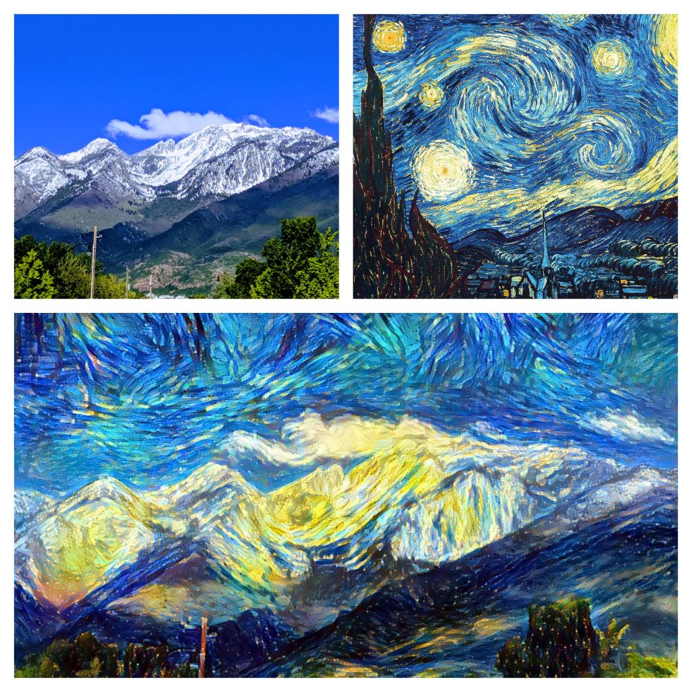
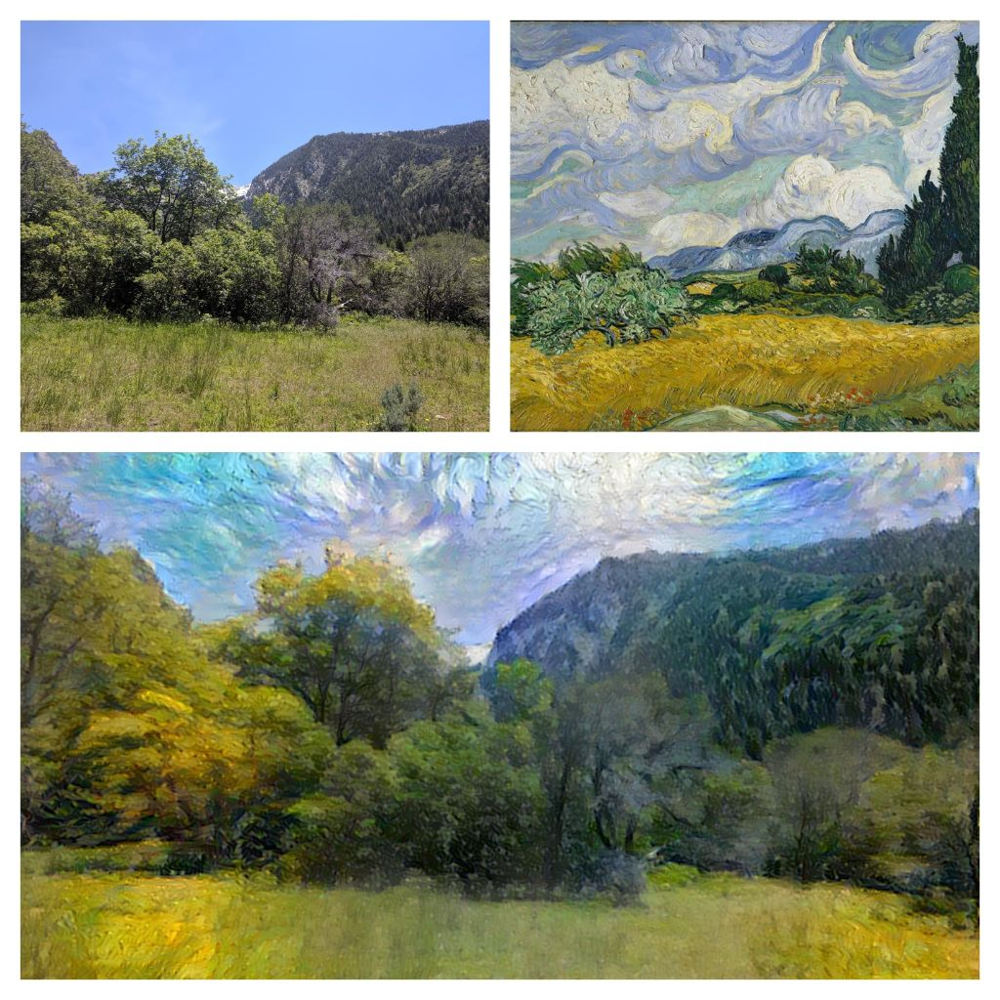
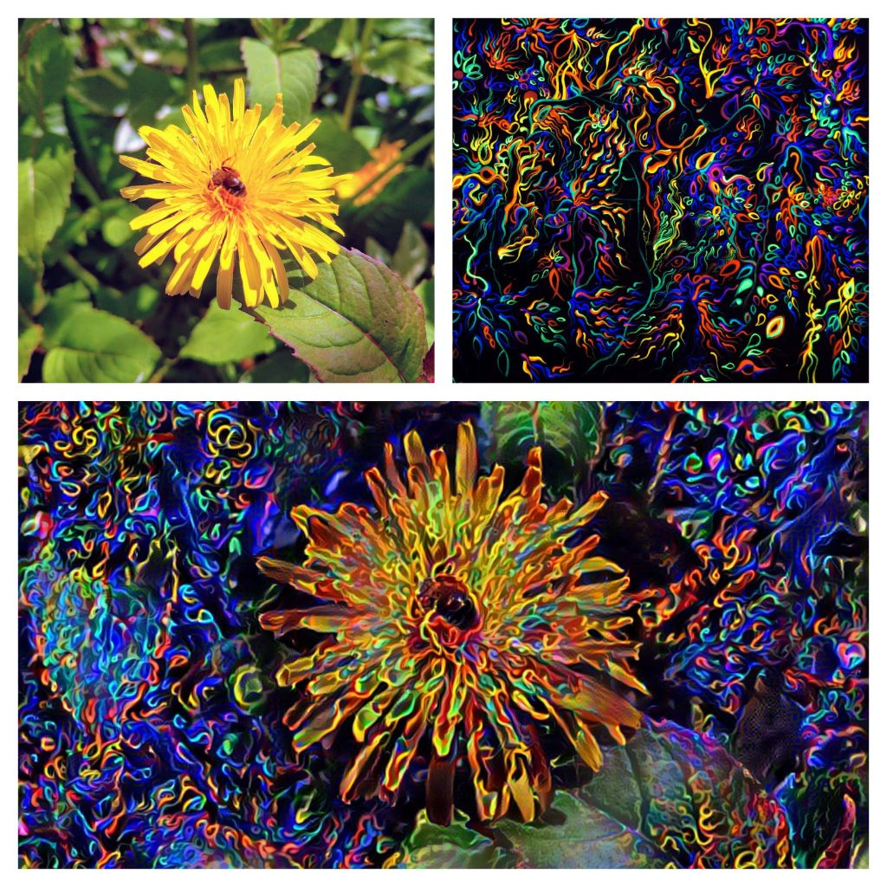

# TensorFlow 2.0 Neural Style Transfer 
TensorFlow 2.0 implementation of A Neural Algorithm of Artistic Style [[1]](https://arxiv.org/abs/1508.06576). 
New/existing TensorFlow features found in this repository include eager execution, AutoGraph, and Keras high-level API.

## Requirements
* [Python 3](https://www.python.org/)
* [Abseil](https://abseil.io/)
* [NumPy](http://www.numpy.org/)
* [TensorFlow >= 2.0](https://www.tensorflow.org/versions/r2.0/api_docs/python/tf)
* [tqdm](https://tqdm.github.io/)

## Usage
**Install requirements**
```
$ pip install -r requirements.txt
```

**Generate image**
```
$ python main.py -content_path 'content_example.jpg' -style_path 'style_example.jpg'
```

## Results






## References
[1] [A Neural Algorithm of Artistic Style](https://arxiv.org/abs/1508.06576) 
